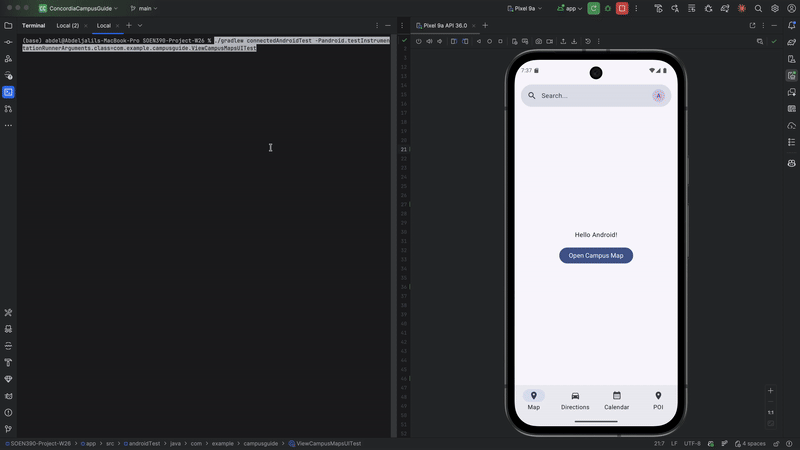
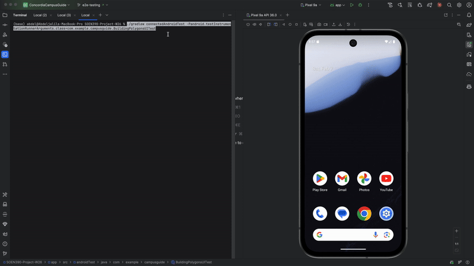
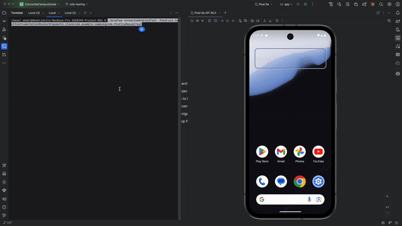

# Acceptance Test GIFs - Sprint 2

This page shows our project's automated Espresso UI tests for Sprint 2 user stories. Each test demonstrates the feature acceptance criteria being verified programmatically.

---

## US-1.1: View SGW and Loyola Campus Maps

Links to [AT-1](#) *(Replace # with actual AT-1 issue number after creating issue)*



**Test File:** `ViewCampusMapsUITest.kt`

**Verifies:**
- App launches and displays map screen by default
- SGW campus map loads and is visible
- Map is interactive (pan, zoom, rotate)
- Google Maps renders correctly
- Campus buildings are visible on the map

---

## US-1.2: Render Campus Building Shapes (Polygons)

Links to [AT-2](#) *(Replace # with actual AT-2 issue number after creating issue)*



**Test File:** `BuildingPolygonsUITest.kt`

**Verifies:**
- Campus buildings are rendered as colored polygons
- Building polygons are distinct from city buildings
- Polygons match actual building footprints
- Building shapes are visible at appropriate zoom levels
- Polygons render for both SGW and Loyola campuses

---

## US-1.3: Switch Between SGW and Loyola

Links to [AT-3](#) *(Replace # with actual AT-3 issue number after creating issue)*


**Test File:** `CampusSwitchingUITest.kt`

**Verifies:**
- Campus toggle switch is visible on map screen
- User can switch from SGW to Loyola campus
- User can switch from Loyola to SGW campus
- Map overlays update correctly when switching campuses
- SGW buildings are hidden when viewing Loyola campus
- Loyola buildings are hidden when viewing SGW campus

---

## US-1.6: Implement Main App Navigation

Links to [AT-4](#) *(Replace # with actual AT-4 issue number after creating issue)*


**Test File:** `MainNavigationUITest.kt`

**Verifies:**
- Bottom navigation bar is visible on main screens
- Map tab opens map screen
- Calendar tab opens calendar screen
- Profile tab opens profile screen
- Active tab is highlighted
- Navigation transitions are smooth
- Back button works correctly from each screen

---

## US-1.7: Access Profile Menu from Search Bar

Links to [AT-5](#) *(Replace # with actual AT-5 issue number after creating issue)*



**Test File:** `ProfileMenuAccessUITest.kt`

**Verifies:**
- Account icon (A) is visible in top bar on map screen
- Tapping account icon opens user settings page
- Settings page displays correctly
- User can access profile information
- User can access accessibility settings
- Back button returns to map screen

---

## US-1.10: Implement Text Accessibility Features

Links to [AT-6](#) *(Replace # with actual AT-6 issue number after creating issue)*


**Test File:** `TextAccessibilityUITest.kt`

**Verifies:**
- Accessibility settings page is accessible from profile menu
- Font size can be adjusted (small, medium, large, extra large)
- Font size changes apply across all screens
- High contrast mode can be enabled
- Color filter options are available (protanopia, deuteranopia, tritanopia)
- Color filters apply to map and UI elements
- Settings persist across app sessions

---

## Running These Tests

All tests are automated Espresso UI tests that run on Android devices/emulators.

### Prerequisites
- Android device or emulator running
- API level 24 or higher

### Run All Acceptance Tests
```bash
./gradlew connectedAndroidTest
```

### Run Specific Test
```bash
./gradlew connectedAndroidTest -Pandroid.testInstrumentationRunnerArguments.class=com.example.campusguide.CampusSwitchingUITest
```

### Test Location
All acceptance tests are located in: `app/src/androidTest/java/com/example/campusguide/`

---

## Recording Instructions

To recreate these GIF recordings:

1. Start Android Emulator (Pixel 9A or similar)
2. Start screen recording: `adb shell screenrecord /sdcard/test.mp4`
3. Run the specific test: `./gradlew connectedAndroidTest -Pandroid.testInstrumentationRunnerArguments.class=com.example.campusguide.TestName`
4. Stop recording: `Ctrl+C` in the screenrecord terminal
5. Pull recording: `adb pull /sdcard/test.mp4`
6. Convert to GIF using ffmpeg or online tool (ezgif.com)
7. Save to `docs/acceptance-tests/gifs/` directory

---

**Sprint:** 2
**Team:** The Null Pointers
**Last Updated:** February 2026
